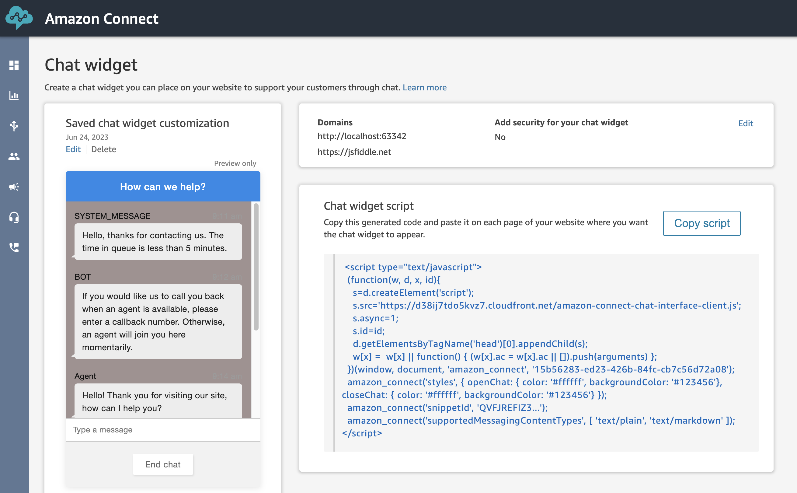
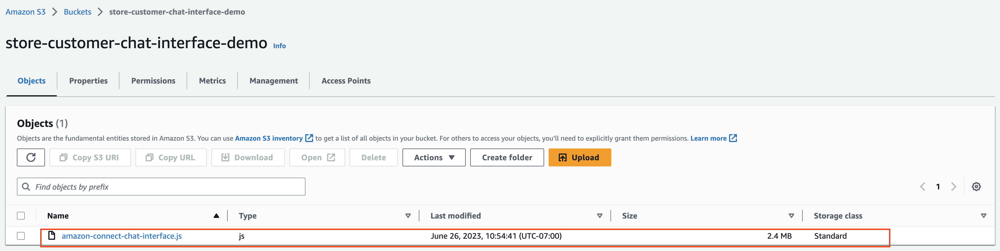
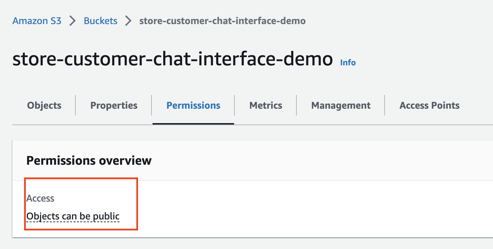
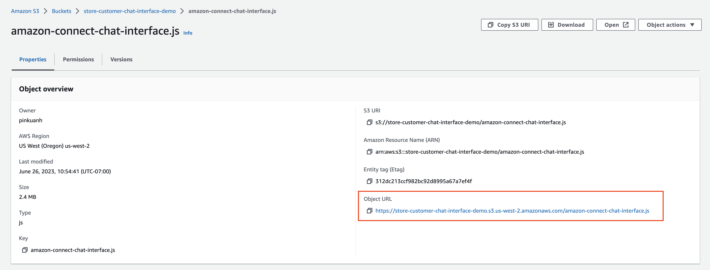
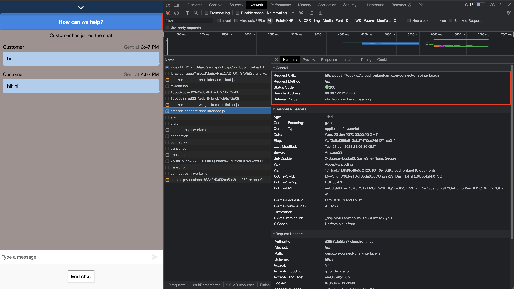
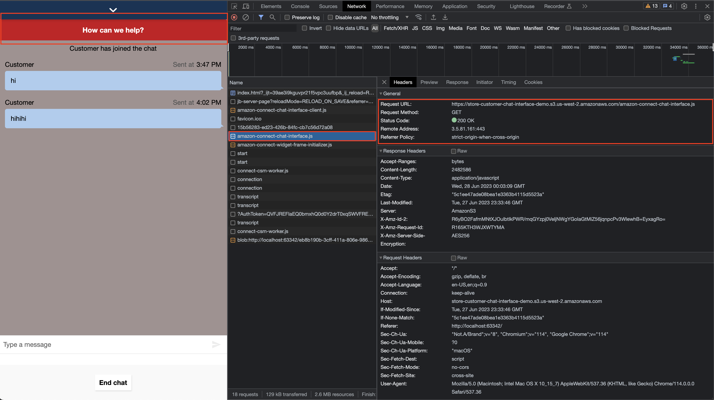

# Host Widget Snippet Integrated Custom UI (S3 Bucket/CDN)

## Overview
Integrate a fully customized the chat interface UI in the pre-built Hosted Widget, with all configurations available in the Connect Admin Console. The hosted widget can handle all of the logic to render the widget on your website and start chat sessions.

If your intention is to only customize [amazon-connect-chat-interface.js](https://github.com/amazon-connect/amazon-connect-chat-interface) and use it in your chat widget, you can consider this method as a quick way to do it. If you want to customize [amazon-connect-chat.js](https://github.com/amazon-connect/amazon-connect-chatjs), this method is not suitable.

## References

- [Amazon Connect Open Source Documentation](https://docs.aws.amazon.com/connect/latest/adminguide/download-chat-example.html)
- [Amazon Connect Chat Experience Admin Guide](https://docs.aws.amazon.com/connect/latest/adminguide/add-chat-to-website.html)

## Prerequisites

- Create an Amazon Connect Instance [[guide](https://docs.aws.amazon.com/connect/latest/adminguide/amazon-connect-instances.html)]
  - OR: enable chat experience for an existing Connect instance. [[guide](../README.md#enabling-chat-in-an-existing-amazon-connect-contact-center)]

- Create an Amazon Connect Contact Flow, ready to receive chat contacts. [[guide](https://docs.aws.amazon.com/connect/latest/adminguide/chat.html)]

    - For demo purposes, you can start with the ["Sample Inbound Flow (First Contact)"](https://docs.aws.amazon.com/connect/latest/adminguide/sample-inbound-flow.html)

## Setup
1. If you don't already have a Chat Widget instance in your AWS account, please set one up by following this [AWS Guide](https://docs.aws.amazon.com/connect/latest/adminguide/tutorial1-set-up-your-instance.html).

2. On the Chat Widget Panel, you can see your Chat widget script.


3. You can customize and upload your `amazon-connect-interface.js` file to your own S3 bucket or any storage server. Follow [customize interface.js steps](https://github.com/amazon-connect/amazon-connect-chat-interface/blob/spenlep/improve-readme-documentation/DOCUMENTATION.md#features) to customize `amazon-connect-interface.js`.

    - 3-1. Build your own amazon-connect-chat-interface.js and upload it in your S3 bucket.
    
    - 3-2. Bucket access should be public.
    

4. Now, with just one line of script added to your Chat Widget script, you can use `amazon-conncet-chat-interface.js` in your chat widget.
    - 4-1. Copy the link to customized `amazon-connect-chat-interface.js`.
    

    - 4-2. Use the link as a parameter in the following script. Include this script along with your Chat Widget script and paste it into your website file.

        ```
        amazon_connect('customerChatInterfaceUrl', 'https://...'); # TODO: put in your link to amazon-connect-chat-interface.js
        ```
 
5. You should see the source of `amazon-connect-chat-interface.js` is now your file.

    - Before(using Amazon default `amazon-connect-chat-interface.js`):
     

    - After (using your customized  `amazon-connect-chat-interface.js`):
     

## Usage

Host your own `amazon-connect-chat-interface.js` bundle file and provide the link in the widget snippet configuration. Retrieve this snippet code from the Connect Admin Console: [Documentation - "Chat widget script"](https://docs.aws.amazon.com/connect/latest/adminguide/add-chat-to-website.html#chat-widget-script)

```diff
<script type="text/javascript">
  (function(w, d, x, id){s=d.createElement('script');s.src='https://d2s9x5slbvr0vu.cloudfront.net/amazon-connect-chat-interface-client.js';s.async=1;s.id=id;d.getElementsByTagName('head')[0].appendChild(s);w[x]=w[x]||function(){(w[x].ac=w[x].ac||[]).push(arguments)}})(window, document, 'amazon_connect', 'asdfasdfasdf');
  
  amazon_connect('styles', { openChat: { color: '#ffffff', backgroundColor: '#07b62a'}, closeChat: { color: '#ffffff', backgroundColor: '#07b62a'} });
  amazon_connect('snippetId', 'asdfsadfasdf...');
  amazon_connect('supportedMessagingContentTypes', [ 'text/plain', 'text/markdown' ]);
+ amazon_connect('customerChatInterfaceUrl', 'https://...'); # TODO: put in your link to amazon-connect-chat-interface.js
</script>
```