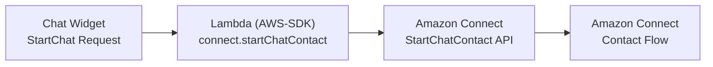

# Passing Custom Attribute to Contact Flow

When initializing the chat with a StartChatContact request, you can pass custom attributes to the the contact flow. 



## Reference

 - `StartChatContact` API - [Documentation](https://docs.aws.amazon.com/connect/latest/APIReference/API_StartChatContact.html)
 - Admin Guide - ["Use Amazon Connect contact attributes"](https://docs.aws.amazon.com/connect/latest/adminguide/connect-contact-attributes.html)
 - Example `startChatContactAPI` Lambda - [CloudFormation Template](https://github.com/amazon-connect/amazon-connect-chat-ui-examples/blob/master/cloudformationTemplates/startChatContactAPI/js/startChatContact.js)
 
 
## Configuration

1. If using the GitHub [`AmazonConnectChatWidget`](https://github.com/amazon-connect/amazon-connect-chat-interface), pass in custom `contactAttributes` to the `ChatInterface.initiateChat()` method. This will pass `"Attributes"` key in the request body

```js
// https://github.com/amazon-connect/amazon-connect-chat-interface/blob/master/src/components/Chat/ChatInitiator.js

connect.ChatInterface.initiateChat({
  name: customerName,
  region: ${region},
  contactFlowId: "${contactFlowId}",
  instanceId: "${instanceId}",
  apiGatewayEndpoint: "${apiGatewayEndpoint}",
  contactAttributes: JSON.stringify({
    "customerName": customerName,
    "customAttribute": "myCustomAttribute". // <------ CUSTOM ATTRIBUTE HERE
  }),
  
},successHandler, failureHandler)
```
    
2. Update the lambda making the [`StartChatContact`](https://docs.aws.amazon.com/connect/latest/APIReference/API_StartChatContact.html) call, make sure to forward `body["Attributes"]` to `connect.startChatContact()`

```js
/*
  Example `startChatContactAPI` lambda making a call to the Amazon Connect public StartChatContact API
  
  LINK: https://github.com/amazon-connect/amazon-connect-chat-ui-examples/blob/master/cloudformationTemplates/startChatContactAPI/js/startChatContact.js

  1) Chat Widget will make request to this Lambda
  2) Lambda will forward the request to the Amazon Connect Backend
*/

var AWS = require('aws-sdk');
AWS.config.update({region: process.env.REGION});
var connect = new AWS.Connect();

exports.handler = (event, context, callback) => {
    console.log("Received event: " + JSON.stringify(event));
    var body = JSON.parse(event["body"]);

    startChatContact(body).then((startChatResult) => {
        callback(null, buildSuccessfulResponse(startChatResult));
    }).catch((err) => {
        console.log("caught error " + err);
        callback(null, buildResponseFailed(err));
    });
};

function startChatContact(body) {
	return new Promise(function (resolve, reject) {
        var startChat = {
            "InstanceId": body["InstanceId"],
            "ContactFlowId": body["contactFlowId"],
            "Attributes": {
                "customerName": body["ParticipantDetails"]["DisplayName"],
                // ...
                ...body["Attributes"] // <------ CUSTOM ATTRIBUTE HERE
            },
            "ParticipantDetails": {
                "DisplayName": body["ParticipantDetails"]["DisplayName"]
            },
        };
        
        // https://docs.aws.amazon.com/connect/latest/APIReference/API_StartChatContact.html
        connect.startChatContact(startChat, function(err, data) {
            if (err) {
                console.log("Error starting the chat.", err);
                reject(err);
            } else {
                console.log("Start chat succeeded with the response: " + JSON.stringify(data));
                resolve(data);
            }
        });
    });
}
```

3. Consume the new attribute in the contact flow. Refer to the Admin Guide - ["Use Amazon Connect contact attributes"](https://docs.aws.amazon.com/connect/latest/adminguide/connect-contact-attributes.html)

