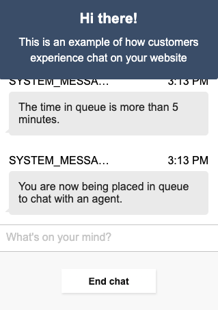

# Amazon Connect Chat Interface
## Overview
Amazon Connect Chat Interface is a light interface to create a customer widget for getting started with Amazon Connect chat. This package contains
some lightweight components to render chat out of the box in your website, with a thin layer on top of [ChatJS](https://github.com/amazon-connect/amazon-connect-chatjs)
to manage your chat session.

An example of how you can add this package to an html page is described in the [local-testing](local-testing/) folder. You can see other examples in this [GitHub repo](https://github.com/amazon-connect/amazon-connect-chat-ui-examples/tree/master/cloudformationTemplates/startChatContactAPI#prebuilt-chat-widget) as well.

## Building the package

Importing this file into your project will place a `ChatInterface` object on the window, which contains a method to `initiateChat`.
To initiate the chat, you will pass in some details about your Connect instance, the requesting user, and the API Gateway generated 
via the [getting started process](https://github.com/amazon-connect/amazon-connect-chat-ui-examples/tree/master/cloudformationTemplates/startChatContactAPI#prebuilt-chat-widget).

### Local
To make local modifications to this package and test them on your webpage, simply make your edits and run `npm install && npm run dev-build` to produce the
Webpack built file and the sourcemaps. You can import these in the same fashion as the getting started examples.

### Production
To build the production version of this package, simply run `npm install && npm run build`. These will generate a minified built file, with console logs stripped and other Webpack optimizations.
Import this into your package as is described in the GitHub examples.

## Customization
### Logger Configuration
The logger is provided by [amazon-connect-chatjs](https://github.com/amazon-connect/amazon-connect-chatjs) package, you can configure it in this file: `src/utils/log.js`.
- By default, the logger is activated in this package with `INFO` level. If you want to deactivate it, you can set `config.loggerConfig.useDefaultLogger` to `false`.
- There are three log levels available - DEBUG, INFO, ERROR.
- If you want to use your own logger, you can add them into `customizedLogger` , and add `customizedLogger` object as the value of `globalConfig.loggerConfig.customizedLogger`, then set the lowest logger level. `globalConfig.loggerConfig.useDefaultLogger` is not required.
- If you want to use the default logger provided by Chat-js, you can set the logger level, and set `useDefaultLogger` to true. `globalConfig.loggerConfig.customizedLogger` is not required.
- If you not only provide your own logger, but also set `useDefaultLogger` to true, your own logger will be overwritten by the default logger.
- How we define log level?
  1. DEBUG: Print meta data, we can use it to print api response data;
  2. INFO: Print the information regarding the current state, or the most recent user event.
  3. ERROR: Print the error messages caused by UI issue, API issue or network issue.
  
```
// Add your own logger function here
var customizedLogger = {
  debug: (data) => {// customize logger function here},
  info: (data) => {// customize logger function here},
  error: (data) => {// customize logger function here}
}
  
var globalConfig = {
  loggerConfig: {
    // You can provide your own logger here, otherwise 
    // this property is optional
    customizedLogger: customizedLogger,
    // There are three levels available - DEBUG, INFO, ERROR. Default is INFO
    level: connect.LogLevel.INFO,
    // Choose if you want to use the default logger
    useDefaultLogger: true
  }
};
  
connect.ChatSession.setGlobalConfig(globalConfig);
```
### Theme
To customize the theme, determine which aspect(s) of the chat interface you would like to modify, make your changes and build the file as described above.

Occasionally, a component will pull a style value from `src/theme/defaultTheme.js`, so it is important to be aware of this source of customization.

See below sections for high level description of each major component.

### Audio Notifications
A commonly requested feature for the Connect Chat Interface is to play a sound when a new message is received from the agent. This can be done via the  `onMessage` event.

An implementation might look like the following, in the constructor of `ChatSession.js` (although you can set this up anywhere you have access to the ChatJs `chatSession` object):
```js
const audioObj = new Audio('my-notification-sound.mp3');

this.session.onMessage(event => {
  const { chatDetails, data } = event;
  if (data.ParticipantRole === "AGENT") {
    audioObj.play();
  }
});
```

Note that for larger audio files you may need to more gracefully handle when the audio is actually available to play: https://developer.mozilla.org/en-US/docs/Web/API/HTMLAudioElement/Audio#determining_when_playback_can_begin.


## Components
High level overview of some of the major components below, to help understand the chat interface.

### Chat.js (src/components/Chat)
Chat.js serves as the top level UI wrapper for the chat experience. It contains the styling for the `Header`, and invokes the `ChatTranscriptor`, `ChatComposer`, and `ChatActionBar`. 

For example, we can update the Header background color by updating the background to red in `Chat.js`.
```
const HeaderWrapper = styled.div`
  background: #3F5773;
  text-align: center;
  padding: 20px;
  color: #fff;
  border-radius: 3px;
`
```

**Before**:


**After**:


### Chat Transcriptor (src/components/Chat/ChatTranscriptor)
The Chat Transcriptor is responsible for rendering the transcript of the Chat in the widget. It handles typing events, sent messages, received messages, and scrolling.

Make changes here to update message bubbles, chat background, and more.

### Chat Action Bar
The action bar covers the UI underneath the chat input area. For the default chat widget experience, it contains the functionality to end a chat and close the chat window.

A customization to the action bar background in this file to `palette.lightGreen` might look as follows:


### Chat Composer
The chat composer is responsible for the editable text area where the customer constructs and sends their messages. 

Changes can be made here for the hint text ("Type a message"), as well as the edit container styles.

Example changing `FormattedMessage` hint text to "What's on your mind?":


